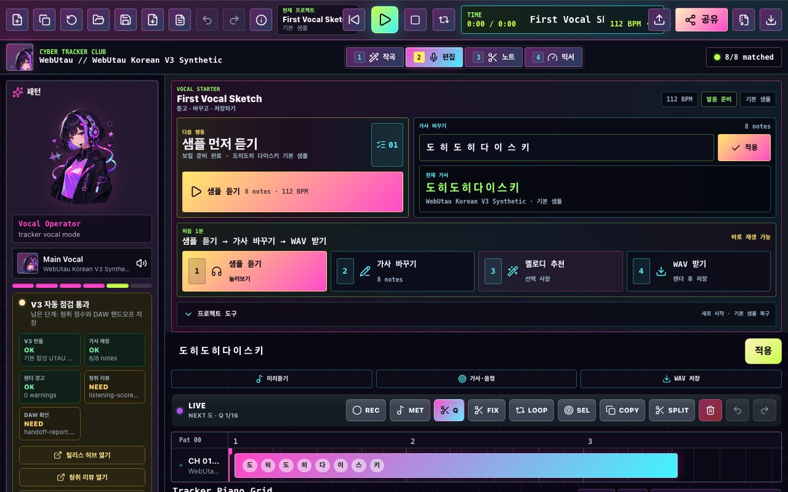
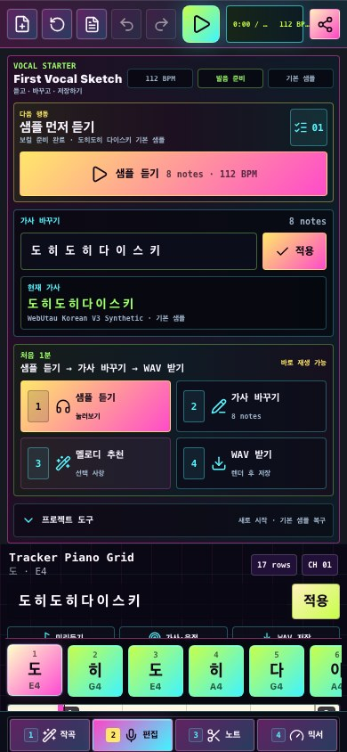

# WebUtau

<div align="center">
  

  <h3>Cyber vocal synth for Hangul lyrics, UTAU voicebanks, and browser-based WAV rendering.</h3>

  <p>
    <a href="https://midagedev.github.io/webuta/">Live App</a>
    ·
    <a href="docs/LICENSE_BOUNDARIES.md">License Boundaries</a>
    ·
    <a href="docs/VOICEBANK_METHODOLOGY.md">Voicebank Methodology</a>
    ·
    <a href="docs/UTAU_V3_WORKPLAN.md">UTAU V3 Workplan</a>
    ·
    <a href="docs/PORTING_ROADMAP.md">Porting Roadmap</a>
  </p>

  <p>
    
    
    
    
  </p>
</div>

WebUtau is a browser-first vocal synth editor inspired by OpenUtau-style workflows. It is built for a simple vocal sketching loop:

1. Open the app in a browser.
2. Type a short lyric line such as `도히도히 다이스키`.
3. Sketch notes on a piano-roll/tracker grid.
4. Audition the synthesized vocal line.
5. Render a 44.1 kHz / 16-bit / mono WAV for later use in music tools.

The first screen is intentionally action-led: the starter card shows `VOCAL STARTER`, `다음 행동`, the focused `샘플 먼저 듣기` next action with a current-step badge, an inline starter lyric input, `처음 1분`, large starter cards for `샘플 듣기`, `가사 바꾸기`, `멜로디 추천`, and `WAV 받기`, the current lyric preview, and a folded `프로젝트 도구` row before the deeper editor controls.

The app now ships with `WebUtau Korean V3 Synthetic`, a fully generated UTAU-style Korean voicebank. It is loaded as a bundled zip with `oto.ini` and WAV samples, so the default path exercises the same sample-rendering route as imported UTAU voicebanks. The current web profile contains 615 generated WAV samples and 1437 aliases, including full Korean CV coverage at a web-friendly main pitch plus demo-priority multipitch and coda samples. The bundled samples are generated by WebUtau DSP tooling, not recorded from a human singer, derived from public/private recorded datasets, cloned from a voice, or rendered from a third-party TTS/model service. No personal voice recording is needed for the bundled starter singer.

Kasane Teto assets are not bundled in this repository. For the real UTAU path, import the official Teto OpenUTAU/UTAU zip yourself in the browser. The zip stays local to the current device and is cached only in that browser's IndexedDB storage.

## No Recording Needed

The default WebUtau singer is generated by this repository. The app, review flow, and release checklist must not ask the user, the user's family, or reviewers to record new voice material for the bundled starter voicebank. If the voice quality is not good enough, the active path is to improve the generator, renderer, oto timing, and synthetic sample pack.

## Screenshots

| Desktop starter editor | Mobile first-run editor |
| --- | --- |
|  |  |

## What Works Today

- Neon cyber vocal editor UI with compact tracker-style status cells.
- First-run starter panel with a clear `VOCAL STARTER` / `처음 1분` / `다음 행동` launcher, inline lyric input, current lyric preview, folded project tools, compose, play, and WAV handoff actions.
- Piano-roll note editing with draw, drag, resize, duplicate, split, delete, keyboard movement, undo, and redo.
- Per-note `Intensity`/dynamics controls, imported/exported through UST and rendered through both bundled UTAU samples and browser fallback voice.
- Classic UST resampler expression fields for `Velocity`, `Modulation`, and `Flags`, with `Velocity` applied to the UTAU sample renderer's consonant/source movement.
- Classic UST note timing overrides for `StartPoint`, `PreUtterance`, and `VoiceOverlap`, imported/exported and applied by the UTAU sample renderer.
- Classic UST `Envelope` curves for note attack/release/sustain, imported/exported and rendered as per-note volume movement.
- Per-note vibrato controls for depth, rate, and start position, rendered through both the bundled UTAU sample path and browser fallback voice.
- Selected-note pitch-bend controls for a simple 3-point curve, with UST pitch curves loaded into the same note model.
- Classic UST `PBS`/`PBW`/`PBY` pitch-bend curves are preserved on import/export and rendered as per-note pitch movement.
- OpenUtau USTX `pitch.data` curves are preserved on import/export and rendered as WebUtau pitch bends with millisecond point timing, `snap_first`, and basic `l`/`i`/`o`/`io`/`sp` curve shapes.
- Selected-note pitch editing keeps imported curve points, shape modes, and start-snap metadata when adjusting bend amount, bend position, curve mode, or snap behavior.
- Loop playback and selected-note loop targeting for tight vocal phrase checks.
- UST/USTX tempo map preservation, visible tempo-map markers, and rendered note timing calculated from tempo events instead of only one global BPM.
- OpenUtau USTX `phonemeExpressions` round-trip for `vel`, `vol`, and `mod`, mapped to WebUtau velocity, intensity, and modulation controls.
- Separate top-bar actions for a fresh project, duplicating the current project, and resetting the built-in demo.
- Native `.webutau.json` project save/import, plus classic UST and USTX import/export for UTAU/OpenUtau handoff.
- DAW handoff ZIP export that bundles the rendered WAV, `.webutau.json`, USTX, UST, manifest, and README into one portable archive.
- Hangul lyric line assignment for the built-in `도 히 도 히 다 이 스 키` demo phrase.
- Built-in `WebUtau Korean V3 Synthetic` UTAU-style sample voicebank for default playback and render tests.
- User-provided UTAU/OpenUTAU zip loading, including official Kasane Teto test coverage.
- Browser-safe UTAU zip import limits for package size, sample count, unsafe paths, and oversized WAV/oto members.
- UTAU `prefix.map` parsing for imported multipitch voicebanks that use pitch-specific alias prefixes or suffixes.
- Voicebank alias coverage display, so missing syllables are visible before rendering.
- Current voicebank license/readme metadata card, including bundled V3 and user-imported zip packages.
- Voicebank origin metadata card, so the bundled V3 manifest visibly confirms self-generated, no-recording, no-dataset, no-TTS lineage.
- Selected-note UTAU sample preview, so a singer zip can be auditioned without rendering the whole song.
- Per-note render warnings for missing aliases, missing Hangul coda tails, and extreme sample pitch shifts.
- Community release readiness card that separates automated V3 checks from the required human listening scorecard.
- Public release review hub under `review/`, linked from the app, that routes reviewers to the two final evidence builders.
- Public V3 listening review scorecard under `review/v3/`, linked from the app, for scoring generated V3 WAVs against the legacy V2 baseline.
- Public WAV/DAW handoff report builder under `review/wav-daw/`, linked from the app, for generating `handoff-report.local.json` after a physical-device DAW import pass.
- WAV render inspection for RIFF/WAVE PCM, 16-bit, mono, 44100 Hz output.
- Local project and voicebank restore after refresh on the same browser.
- PWA app-shell caching after the first online load.
- In-app license panel that separates project code, original artwork, and user-provided voicebanks.

## Beginner Workflow

Use this path for a first vocal sketch:

1. Open [the live app](https://midagedev.github.io/webuta/).
2. Confirm the starter card says `VOCAL STARTER`, `다음 행동`, and `샘플 듣기 → 가사 바꾸기 → WAV 받기`.
3. Keep `WebUtau Korean V3 Synthetic` selected, or import a local UTAU zip with `ZIP`.
4. Edit the lyric line. The default is `도히도히 다이스키`.
5. Press `가사 바꾸기` or `적용` to assign lyrics to the notes.
6. Press `멜로디 추천` for the compose panel, or edit notes directly in the piano roll.
7. Press `샘플 듣기` to audition.
8. Press `WAV 받기`, `WAV`, or `공유`.
9. Use the rendered WAV in your music project.

## Limitations

- `WebUtau Korean V3 Synthetic` is a license-clean generated starter voicebank, not a commercial neural singer, human recording, or dataset-derived voice clone.
- Korean clarity is useful for sketching and demos, but the V3 voice still needs human listening review before it should be called community-release-ready.
- Imported UTAU voicebanks are rendered with WebUtau's browser-safe sample renderer, not desktop OpenUtau's full resampler/plugin stack.
- Kasane Teto and other third-party voicebanks must be imported by the user from their official sources; they are not bundled here.

## Official Teto Test Asset

The repository includes a local-only test helper for the official Kasane Teto OpenUTAU UTAU zip:

```sh
npm run asset:teto
npm run test:teto
```

This downloads `TETO-OUset240323.zip` into ignored `test-assets/` and verifies that WebUtau can read its `character.yaml`, `oto.ini`, aliases, and WAV sample inventory. The test also renders the built-in Korean demo line through the local Teto samples using the browser UTAU sample renderer path.

Do not commit the downloaded Teto zip. The repository is MIT-licensed, but Teto voicebank files remain governed by their own official license and distribution terms.

## Run Locally

```sh
npm install
npm run dev
```

Open:

```txt
http://127.0.0.1:5173/
```

## Checks

```sh
npm run notices
npm run voicebank:v3
npm run voicebank:audit-v3
npm run voicebank:demo-v3
npm run voicebank:demo-v3:pages
npm run voicebank:oto-v3
npm run voicebank:loop-v3
npm run voicebank:sustain-v3
npm run voicebank:pitch-v3
npm run voicebank:clarity-v3
npm run voicebank:review-v3
npm run voicebank:publish-review-v3
npm run release:accept-evidence -- --scores path/to/listening-scores.local.json --handoff path/to/handoff-report.local.json
npm run voicebank:accept-review-v3 -- --scores path/to/listening-scores.local.json
npm run release:accept-daw-handoff -- --handoff path/to/handoff-report.local.json
npm run screenshots:readme
npm run lint
npm test
npm run build
npm run test:teto
```

Current verified local smoke coverage:

- Official Teto zip imported in browser.
- `6216` UTAU aliases and `1822` WAV samples detected.
- Built-in `도히도히 다이스키` demo reports `8/8 matched` against the official Teto zip.
- Bundled `WebUtau Korean V3 Synthetic` contains `615` WAV samples and `1437` oto.ini alias lines in the default web profile.
- `npm run voicebank:demo-v3` verifies the first-run V3 demo in Chromium and exports a DAW-ready WAV.
- `npm run voicebank:demo-v3:pages` verifies the deployed GitHub Pages app in Chromium, including default V3 selection, desktop/mobile layout, and live WAV download.
- The first-run browser smoke verifies the `VOCAL STARTER` / `다음 행동` / `샘플 먼저 듣기` focused next action, current-step badge, inline starter lyric input, `처음 1분` route, `샘플 듣기`, `가사 바꾸기`, `멜로디 추천`, `WAV 받기`, folded `프로젝트 도구`, and current lyric preview are visible before WAV handoff.
- The first-run browser smoke verifies the `템포 맵` panel is visible, so imported UST/USTX tempo events are not hidden from the DAW workflow.
- The first-run browser smoke now verifies the community release readiness card is visible and still marks human listening scores as required.
- The first-run browser smoke verifies the current voicebank license metadata card and bundled V3 license excerpt are visible.
- The first-run browser smoke verifies the bundled V3 self-generated origin card is visible.
- The first-run browser smoke verifies selected-note dynamics controls are visible.
- The first-run browser smoke verifies selected-note resampler controls are visible.
- The first-run browser smoke verifies selected-note timing controls are visible.
- The first-run browser smoke verifies selected-note envelope controls are visible.
- The first-run browser smoke verifies selected-note vibrato controls are visible.
- The first-run browser smoke verifies selected-note pitch-bend controls are visible.
- Unit tests verify UST `Intensity`, `Velocity`/`Modulation`/`Flags`, timing overrides, `Envelope`, classic pitch-bend curves, OpenUtau USTX `pitch.data` round-trip, and imported pitch metadata preservation in the selected-note editor.
- The first-run browser smoke verifies the selected-note UTAU sample preview action is present for the default V3 voicebank.
- `npm run voicebank:oto-v3` verifies all bundled sample aliases and oto timing windows against the generated V3 manifest.
- `npm run voicebank:pitch-v3` audits all 615 bundled samples and currently reports max median pitch error near `4.5` cents.
- `npm run voicebank:loop-v3` audits all 432 bundled CV/V sustain samples and currently reports max loop residual ratio near `0.032`.
- `npm run voicebank:sustain-v3` renders a long-note UTAU WAV through the browser app and checks sustain clicks, onset/coda energy, intended target pitch error, and in-note pitch drift.
- `npm run voicebank:clarity-v3` audits generated vowel-color separation and consonant onset strength before human listening review.
- `npm run voicebank:review-v3` writes a browser-rendered listening review pack under `experiments/utau-v3/work/v3-listening-review/`.
- `npm run voicebank:publish-review-v3` publishes that review scorecard and its WAVs to `public/review/v3/` for GitHub Pages.
- `npm run release:accept-evidence` validates both downloaded release JSON files, auto-detects them from Downloads when possible, installs them atomically, and then reruns the final release audit.
- `npm run voicebank:accept-review-v3 -- --scores path/to/listening-scores.local.json` validates and installs a human scorecard into the release-audit path.
- `npm run release:accept-daw-handoff -- --handoff path/to/handoff-report.local.json` validates and installs a physical-device WAV/DAW import report into the release-audit path.
- `npm run release:audit-utau` verifies the deployed app, cache-busted V3 zip, public scorecard, and all 8 deployed V3/V2 review WAVs against local byte sizes.
- `npm run release:audit-utau` also verifies the WAV/DAW QA checklist follows the bundled V3 first-run path and requires accepted physical-device DAW handoff evidence before release.
- `npm run screenshots:readme` refreshes the desktop/mobile README screenshots from the live app UI.
- Built-in `도히도히 다이스키` demo aliases are present in the bundled Korean V3 voicebank.
- WAV download created at `test-output/First-Vocal-Sketch.wav`.
- Output format: RIFF/WAVE, PCM, 16-bit, mono, 44100 Hz.
- The app surfaces local voicebank cache status, including `이 기기 저장됨`, `이 기기에서 복원됨`, and `현재 세션 전용`.
- User-imported UTAU zip files are checked in the browser for unsafe paths, abnormal file counts, and oversized samples before parsing or playback.
- Runtime npm dependency notices are generated in `docs/THIRD_PARTY_NOTICES.md`.
- Manual WAV handoff verification is tracked in `docs/WAV_DAW_QA.md` and can be generated from `review/wav-daw/index.html` or accepted from `docs/wav-daw-handoff.local.template.json`.

## Visual Direction

The current interface uses an original cyber vocal mascot illustration and a dense tracker-era editor theme:

- App eyebrow: `CYBER TRACKER CLUB`
- Tracker surface: compact `PAT / CH / BPM / ROWS / BANK / MATCH` status cells with mobile horizontal scrolling.
- Mascot assets:
  - `src/assets/cyber-vocal-hero.webp` for the browser UI and README header
  - `src/assets/cyber-vocal-hero.png` as the transparent PNG source
- Product copy should say `vocal synth`, `singing voice editor`, or `cyber vocal`. It should not imply Vocaloid compatibility.
- No third-party singer likeness, Teto character art, or Teto voicebank files are bundled.
- `public/voicebanks/webuta-ko-v3.zip` is the generated V3 starter voicebank; regenerate it with `npm run voicebank:v3`.
- `public/review/index.html` is the public release review hub for the final listening and WAV/DAW evidence.
- `public/review/v3/index.html` is the generated V3 listening scorecard; regenerate it with `npm run voicebank:review-v3` and `npm run voicebank:publish-review-v3`.
- `public/review/wav-daw/index.html` is the physical-device WAV/DAW handoff report builder for `handoff-report.local.json`.
- When the bundled voicebank changes, bump `BUNDLED_UTAU_VOICEBANK_VERSION` in `src/bundledVoicebank.ts` so browsers fetch the new zip.

## Deploy To GitHub Pages

This repository includes a GitHub Actions workflow at `.github/workflows/pages.yml`.

1. Push the repository to GitHub.
2. In GitHub, open `Settings -> Pages`.
3. Set `Build and deployment -> Source` to `GitHub Actions`.
4. Push to `main`, or run the `Deploy GitHub Pages` workflow manually.

Only `dist/` is published. Kasane Teto voicebank zips in `test-assets/` are ignored local test inputs and must not be committed or uploaded.

## Docs

- [Overnight checklist](docs/OVERNIGHT_CHECKLIST.md)
- [License boundaries](docs/LICENSE_BOUNDARIES.md)
- [Voicebank methodology](docs/VOICEBANK_METHODOLOGY.md)
- [UTAU V3 workplan](docs/UTAU_V3_WORKPLAN.md)
- [Neural singer roadmap](docs/NEURAL_SINGER_ROADMAP.md)
- [Third party notices](docs/THIRD_PARTY_NOTICES.md)
- [WAV DAW QA](docs/WAV_DAW_QA.md)
- [Porting roadmap](docs/PORTING_ROADMAP.md)
